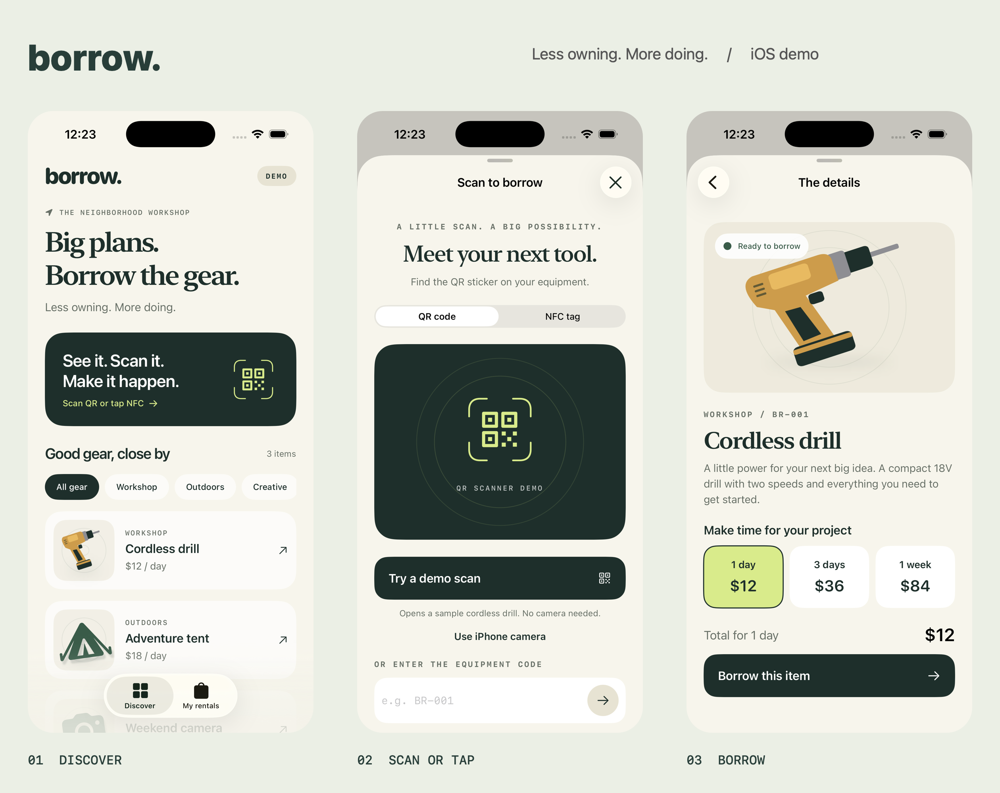

# Borrow — iOS equipment rental demo

A native SwiftUI app for borrowing equipment by scanning a QR label or simulating an NFC tap. The design uses warm paper colors, forest green, citrus accents, editorial typography, and original vector equipment art.

## Run

1. Open `Borrow.xcodeproj` in Xcode 15 or newer (verified with Xcode 26.3).
2. Select the **Borrow** scheme and an iPhone simulator, then press **Run**.
3. Tap the dark scan card → **Try a demo scan** → choose a duration → **Borrow this item** → confirm.
4. Select **View my rentals**, then **Return equipment** to finish the demo.

Minimum deployment target: iOS 17. No packages, backend, account, or API keys are required. To run on a physical iPhone, choose your signing team in the Borrow target's Signing & Capabilities settings.

The app is already installed in the local **iPhone 17 Pro / iOS 26.3** simulator. The machine's global command-line developer path points to CommandLineTools; use a per-command `DEVELOPER_DIR=/Applications/Xcode.app/Contents/Developer` when building from the terminal. No global setting was changed.

## Included

- Equipment catalog with Workshop, Outdoors, and Creative filters.
- QR and NFC demo modes, with manual equipment-code entry.
- Optional live QR scanning through VisionKit, with camera permission and availability handling.
- Equipment details, included accessories, and 1-day, 3-day, or 1-week pricing.
- Explicit demo checkout, confirmation, and return-by date.
- Active rentals, return confirmation, returned history, and local persistence.
- Duplicate-rental prevention; a returned item becomes available again.

## Sample tags

| Equipment | Manual code | QR payload | PNG |
| --- | --- | --- | --- |
| Cordless drill | BR-001 | borrow://equipment/BR-001 | [Drill QR](SampleTags/BR-001.png) |
| Adventure tent | BR-002 | borrow://equipment/BR-002 | [Tent QR](SampleTags/BR-002.png) |
| Weekend camera | BR-003 | borrow://equipment/BR-003 | [Camera QR](SampleTags/BR-003.png) |

Display a tag on another screen or print it with a white margin. Use **Use iPhone camera** inside the app on a supported iPhone. These payloads are resolved inside Borrow; this demo does not register a system-wide URL scheme.

## Demo boundaries

NFC reading is simulated: no Core NFC entitlement or physical-tag session is configured. The in-app QR demo works without a camera; real QR capture is implemented but has not been tested on a physical iPhone. Camera permission denial and unavailable hardware offer the demo/manual-code fallback. See [Apple's scanner documentation](https://developer.apple.com/documentation/visionkit/datascannerviewcontroller) for device availability requirements.

All inventory, workshop locations, rates, and rentals are fictional. Rentals are stored only on this device in UserDefaults. There are no payments, deposits, tax calculations, identity checks, remote inventory reservations, hardware locks, or real-world return verification. In a production app, inventory and rental transitions must be enforced by a backend; payment and NFC support are future integration work.

## Verification

- Debug simulator build passed for arm64 and x86_64 with Xcode 26.3.
- Simulator walkthrough passed: QR demo → duration/pricing → checkout → confirmation → active rental → app relaunch → return → history.
- NFC demo resolved the returned drill and showed it available again.
- Model checks passed for raw IDs and QR URLs, unknown-tag rejection, pricing, due dates, duplicate prevention, persistence, idempotent return, and re-rental.
- Visual review completed on iPhone 17 Pro; screenshots are in `Previews/`.
- Physical scanning and accessibility at very large text sizes have not been device-tested.

Run the model checks from this folder:

```sh
mkdir -p /tmp/borrow-model-checks
swiftc -module-cache-path /tmp/borrow-model-checks/cache Borrow/Models.swift Tests/ModelChecks.swift -o /tmp/borrow-model-checks/checks
/tmp/borrow-model-checks/checks
```

## Source map

- `BorrowApp.swift`: app shell, navigation, catalog, category filters.
- `Design.swift`: reusable styles, buttons, rows, equipment art.
- `ScanView.swift`: QR/NFC demo UI, manual lookup, optional camera scanner.
- `RentalViews.swift`: details, checkout, success, active rentals, and returns.
- `Models.swift`: catalog, payload parsing, rental pricing, state, and persistence.


